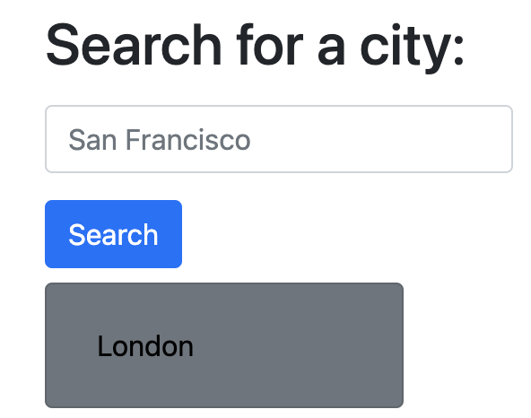
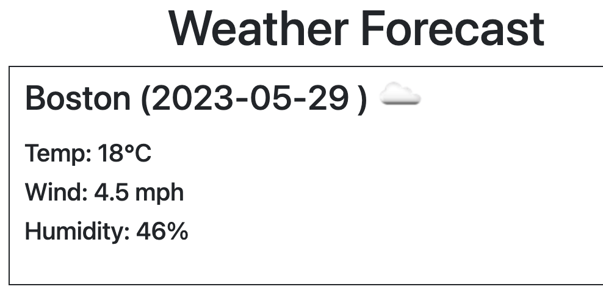
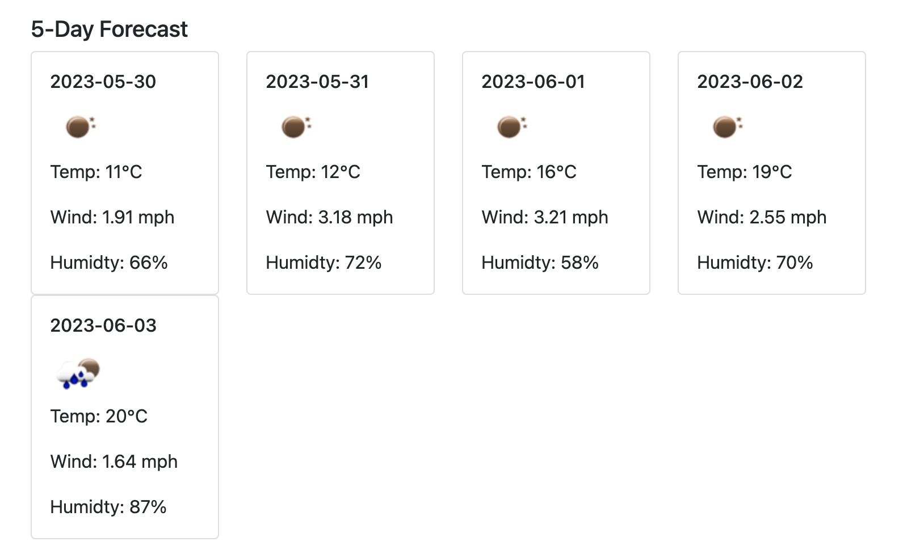

# WeatherApp

## Description

Link to application: https://mjonas14.github.io/WeatherApp/

Following the link will bring you to my Weather Forecast webpage. The webpage is useful for looking at weather data, both for today as well as for the next 5 days!

## Usage

The usage of the website is simple. The user is able to search for a city in the search field, and upon clicking "Search", the weather data will populate, with today's date in the main box and a five day foreward looking forecast below. Each weather card has the date, the temperature, the wind and the humidity, as well as an icon representing the weather. The user's search history is saved beneath the search field. The user is able to click on any of the previously searched cities to display the forecast for that city. 

Image of the search bar and recent searches: 

Image of the main forecast: 

Image of the 5-day forecast:

## Credits

This application utlizes OpenWeather's API to obtain weather data. A link to their website follows, https://openweathermap.org/.

Code to obtain the icon in the 5 day forecast was found at https://stackoverflow.com/questions/44177417/how-to-display-openweathermap-weather-icon.

Thank you to UCB for providing course content to aid in the coding of this application. 

## License

N/A

## Contributing

N/A

## Tests

N/A

## Questions

If you have any questions, please find the repository for this application in GitHub from the username: mjonas14.  
Alternatively, you can click this link: [mjonas14's GitHub](https://github.com/mjonas14).

If you have any additional questions, you can reach me by sending an email to marcus.jonas14@gmail.com. Thank you and look forward to hearing from you! 